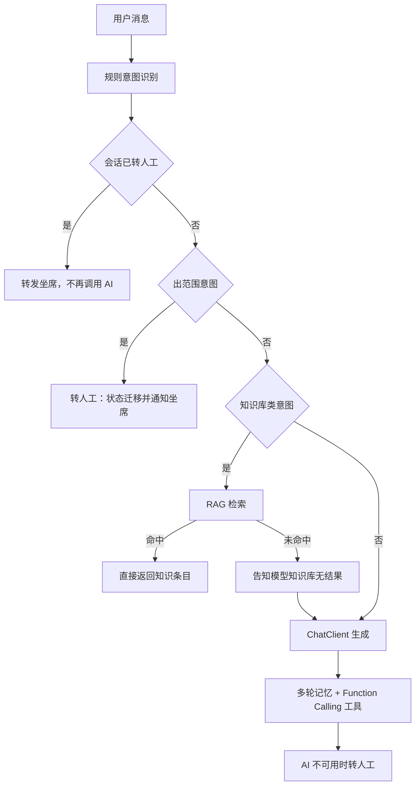

# Hotel 酒店预订管理系统

前后端分离的酒店预订系统。后端 Spring Boot 3 + MySQL + Redis，前端 Vue 3 + TypeScript + Element Plus。智能客服接入 Spring AI，走 OpenAI 兼容协议（默认指向 DeepSeek），提供规则意图识别、知识库 RAG 检索与 Function Calling 工具调用。

## 目录结构

```
hotel/
├── backend/                          Spring Boot 后端
│   ├── pom.xml
│   └── src/
│       ├── main/java/com/hotel/
│       │   ├── ai/                   智能客服：意图识别、RAG、工具调用、WebSocket、Redis 会话记忆
│       │   ├── config/               数据源、Redis、Redisson、WebSocket、AI 等配置
│       │   ├── controller/           REST 接口
│       │   ├── dto/ vo/ entity/      入参、出参与持久化模型
│       │   ├── mapper/               MyBatis-Plus Mapper
│       │   ├── security/             JWT 签发校验、请求与握手拦截器、登录态缓存
│       │   ├── service/              业务服务（含下单事务与并发防护）
│       │   ├── task/                 订单超时、会话回收、支付对账定时任务
│       │   └── utils/
│       ├── main/resources/
│       │   ├── application.yml       公共配置
│       │   ├── application-dev.yml   开发环境覆盖
│       │   ├── application-prod.yml  生产环境覆盖（不提供任何默认密钥）
│       │   └── sql/                  建表与迁移脚本
│       └── test/java/com/hotel/      意图识别用例与并发/基准测试
└── frontend/                         Vue 3 前端
    └── src/
        ├── api/                      axios 封装与按模块划分的接口
        ├── components/               聊天挂件、用户端与管理端布局
        ├── composables/ stores/      useRequest 与 Pinia 状态
        ├── router/                   路由与角色守卫
        └── views/                    页面：auth / home / search / booking / order / account / admin / staff
```

## 功能概览

系统按四种角色划分权限，取值与 `user.role` 一致。

| 角色 | role | 主要功能 |
| --- | --- | --- |
| 普通用户 | 0 | 酒店搜索、下单、支付、订单查询与取消、智能客服会话 |
| 酒店经营者 | 1 | 名下酒店与房型房间维护、订单处理、办理入住退房、经营统计、客服会话与知识库 |
| 系统管理员 | 2 | 全局订单与用户管理、跨酒店经营统计、客服数据看板 |
| 酒店前台 | 3 | 本酒店房间状态维护、前台代客下单 |

数据隔离依据 `hotel.owner_id`：经营者只能看到自己名下酒店的数据，前台账号通过 `user.hotel_id` 绑定到单一酒店。

会员等级 `user.member_level`（0 普通 / 1 银卡 / 2 金卡）决定下单折扣，折扣率配置在 `app.member.discount`，默认 1.00 / 0.95 / 0.88。

## 技术栈

| 层次 | 组成 |
| --- | --- |
| 后端框架 | Spring Boot 3.4.5、Java 17 |
| 持久层 | MyBatis-Plus 3.5.9、MySQL 8 |
| 缓存与分布式锁 | Redis、Redisson 3.27.2 |
| 鉴权 | jjwt 0.12.6；仅引入 spring-security-crypto 使用 BCrypt，不启用完整 Security 过滤链 |
| 实时通信 | Spring WebSocket（STOMP），用于客服消息的双向推送 |
| AI | Spring AI 1.0.0：ChatClient、ChatMemory、Function Calling、PDF 与 Markdown 文档读取、TokenTextSplitter；向量库默认使用内存实现，可通过开关切换到 Chroma |
| 前端 | Vue 3.4、TypeScript 5.4、Vite 5、Element Plus 2.7、Pinia、Vue Router 4、Axios、ECharts 6、@stomp/stompjs |
| 测试 | JUnit 5、Testcontainers 1.21.4（并发用例需要真实 MySQL 行锁与真实 Redis 分布式锁） |

## 快速开始

环境要求：JDK 17、Maven 3.9+、Node.js 18+、MySQL 8、Redis 6+。Docker 为可选依赖，仅在运行并发测试时由 Testcontainers 使用。

### 初始化数据库

核心表由 `schema.sql` 建立，脚本会创建 `hotel` 库、建表并导入种子数据。

```bash
mysql -uroot -p < backend/src/main/resources/sql/schema.sql
```

客服模块的四张表独立成脚本，使用 `IF NOT EXISTS`，可重复执行。

```bash
mysql -uroot -p hotel < backend/src/main/resources/sql/chat_schema.sql
```

另有两个针对存量环境的增量脚本，全新导入时无需执行。`migration_v2_inventory_and_payment.sql` 用于库存语义重构与支付流水业务类型，`migration_v3_chat_observability.sql` 用于补齐客服统计索引。两者都不是幂等脚本，重复执行会报列或索引已存在。

种子账号的密码统一为 `password`。

| 账号 | 角色 | 说明 |
| --- | --- | --- |
| `admin` | 2 管理员 | 可查看全部酒店订单与统计 |
| `owner1` | 1 经营者 | 名下：上海外滩云顶酒店、上海静安宜家快捷酒店 |
| `owner2` | 1 经营者 | 名下：北京王府井豪庭大酒店、杭州西湖悦享酒店 |
| `testuser` | 0 普通用户 | 银卡会员，享受 0.95 折扣 |

### 启动后端

```bash
cd backend
mvn spring-boot:run
```

对话功能需要大模型密钥，未提供时启动可正常完成，但聊天接口会转人工。

```bash
# macOS / Linux
export DEEPSEEK_API_KEY=sk-xxxxxxxx

# Windows PowerShell
$env:DEEPSEEK_API_KEY="sk-xxxxxxxx"
```

### 启动前端

```bash
cd frontend
npm install
npm run dev
```

开发服务器监听 5173 端口，将 `/api` 与 `/ws` 一并代理到后端，前端因此始终以同源方式请求，无需配置跨域。后端地址可通过 `VITE_PROXY_TARGET` 覆盖。

## 环境变量

后端所有敏感取值都从环境变量注入，配置文件中不保留可用的默认密钥。

| 变量 | 默认值 | 说明 |
| --- | --- | --- |
| `SERVER_PORT` | 8080 | 服务端口 |
| `SPRING_PROFILES_ACTIVE` | dev | 生产部署需设为 prod |
| `DB_URL` | 本机 `hotel` 库 | 数据源地址 |
| `DB_USERNAME` / `DB_PASSWORD` | root / 空（dev 为 root） | 生产必须由环境变量提供 |
| `REDIS_HOST` / `REDIS_PORT` / `REDIS_DATABASE` / `REDIS_PASSWORD` | localhost / 6379 / 0 / 空 | Redis 连接 |
| `JWT_SECRET` | dev 有本地默认值，生产无 | 启动期校验非空且不少于 32 字节 |
| `JWT_EXPIRE` | 604800 | Token 有效期，单位秒 |
| `DEEPSEEK_API_KEY` / `DEEPSEEK_BASE_URL` / `DEEPSEEK_CHAT_MODEL` | 空 / `https://api.deepseek.com` / deepseek-chat | 对话模型 |
| `EMBEDDING_ENABLED` | false | false 使用内置本地哈希嵌入，true 走 OpenAI 兼容语义嵌入服务 |
| `EMBEDDING_BASE_URL` / `EMBEDDING_API_KEY` / `EMBEDDING_MODEL` | 硅基流动 / 空 / `BAAI/bge-m3` | 语义嵌入服务 |
| `CHROMA_ENABLED` / `CHROMA_URL` / `CHROMA_COLLECTION` | false / `http://localhost:8000` / hotel_kb | false 使用内存向量库 |
| `CORS_ALLOWED_ORIGINS` | 空 | 为空表示不开启跨域；生产必须显式列出前端域名 |
| `PAYMENT_GATEWAY` | gateway | mock 为本地模拟支付，gateway 未接入时拒绝支付与退款 |
| `PAYMENT_CALLBACK_SECRET` / `PAYMENT_ALLOWED_IPS` | 空 | 回调验签密钥与来源白名单，为空时拒绝或不限制 |
| `PAYMENT_TIMESTAMP_TOLERANCE` | 300 | 回调时间戳容忍窗口，单位秒 |
| `BOOKING_CANDIDATE_POOL_SIZE` | 50 | 候选房间池大小，即房间级锁并行度上限 |
| `BOOKING_MAX_CANDIDATE_ATTEMPTS` | 8 | 单请求最多尝试的候选房间数 |
| `BOOKING_ROOM_LOCK_WAIT_MILLIS` | 50 | 单个候选房间的抢锁等待上限 |
| `CHAT_SESSION_TIMEOUT_MINUTES` | 30 | 会话闲置回收时长，同时作为 Redis 记忆的 TTL |
| `CHAT_RECLAIM_BATCH_SIZE` | 500 | 单次回收上限 |
| `CHAT_MEMORY_WINDOW_SIZE` | 20 | 送入模型的多轮上下文条数 |
| `VITE_PROXY_TARGET` / `VITE_WS_URL` | 空 | 前端开发代理目标与显式 WebSocket 地址 |

## 核心设计

### 下单防超卖的三层防护

库存口径做过一次重构：`room.status` 只表示物理与运营状态（0 空闲、1 停用维修、2 打扫中），某一天是否已被占用完全由 `booking_order` 的日期区间决定。如果沿用早期「下单即把房间置为已订」的写法，一间房被订过任意一天后就会在所有日期上停售。

并发防护被拆成三层，只有后两层是正确性来源。

| 层次 | 手段 | 作用 |
| --- | --- | --- |
| 第一层 | Redisson 房间级分布式锁 | 降低冲突概率。锁失效或候选房间被抢走只会降吞吐，不会超订 |
| 第二层 | 选房时的 `FOR UPDATE` 加锁读 | 剔除已被并发请求抢走的候选房间 |
| 第三层 | 落单后按区间复核订单数的加锁读 | 兜住分布式锁失效的极端情况，命中即回滚 |

锁粒度从房型下沉到房间，是为了把并行度从 1 提升到候选房间数。房型级锁把同一房型的所有下单串行化，吞吐上限被钉在临界区耗时的倒数；房间级锁的临界区并未变短，性能提升完全来自并行度。

锁外的只读准备（酒店房型校验、会员折扣算价、候选房间快照）被刻意移出临界区。候选房间在打散后才逐个尝试，否则所有请求都从同一间房开始抢，房间级锁会退化成单间房的锁。

订单号包含毫秒时间戳与随机后缀，遇到唯一键冲突会重试三次，每次重试都是一次独立事务，异常已随上次事务回滚。

### 房源搜索缓存的版本号失效

搜索缓存不使用按键前缀删除来失效，而是在 Redis 中维护一个版本号 `hotel:search:ver`，缓存键里带上当前版本。失效只需把版本号加一，旧键在各自 TTL 到期后自然消失。这样每次失效都是 O(1)，既不会像 `KEYS` 那样阻塞 Redis，也不会随缓存键数量增长而变慢。

### 智能客服流水线

规则意图识别先于模型调用，目的是让高频问题走确定性路径，只有真正需要生成的部分才交给模型。



意图分类器基于关键词词典，识别 10 类意图，并把支付纠纷、退款、投诉、隐私、法律、医疗等归为出范围意图，一律转人工。匹配优先级为长词优先、等长时先出现者优先、仍相同则按字典序，最后一层用于摆脱对 `Map` 迭代顺序的依赖，保证同一句话在任何 JVM 上都得到同一结论。

知识库检索只对知识库类意图触发，其余意图不检索，避免无关问题被误答。嵌入服务默认使用项目内置的本地哈希嵌入，零外部依赖但只做字面匹配；需要语义匹配时可将 `EMBEDDING_ENABLED` 置为 true。

Function Calling 暴露 5 个工具：房型查询、酒店信息查询、订单查询、创建订单、创建工单。每次生成都会记录命中的工具名与 token 用量，随消息落库，供管理端的会话看板与统计页使用。

回复支持 SSE 流式返回，前端逐片渲染。流式调用中工具可能执行在响应式线程上，那里读不到 `ThreadLocal` 中的用户身份，因此用户身份通过 `ToolContext` 显式传入工具。

会话记忆存放在 Redis，`ChatSessionTimeoutTask` 按闲置时长回收会话，回收阈值与记忆 TTL 保持一致。消息通过 WebSocket 推送，用户队列为 `/queue/chat`，坐席队列为 `/queue/staff`。

### 支付回调的幂等与验签

回调按 `pay_no` 做幂等：同一流水号已成功入账时直接返回，此前失败过的回调则更新原行，避免与唯一键冲突。金额必须与订单金额一致，时间戳超出容忍窗口或签名不匹配的回调会被拒绝。订单状态流转全部使用带状态条件的更新语句，因此支付回调与超时关单并发时只有一方会成功。

订单状态取值为 0 待支付、1 已确认、2 已入住、3 已取消、4 已完成。待支付订单超过 15 分钟未支付，由 `OrderExpireTask` 自动取消；`PaymentReconciliationTask` 负责支付对账。

## 接口约定

后端接口统一挂在 `/api/v1` 下，按模块分组：`auth`、`hotels`、`orders`、`payment`、`user`、`staff`、`admin`、`chat`。响应统一为 `Result<T>`，包含 `code`、`msg`、`data` 三个字段，`code` 为 200 表示成功。

业务异常由 `GlobalExceptionHandler` 按语义映射到对应的 HTTP 状态码（400/401/403/404/409/422/500）。前端 axios 实例的 `baseURL` 为 `/api/v1`，成功分支直接解包 `data` 返回，错误分支优先透出响应体里的 `msg`。分页接口返回 `PageResult<T>`。

请求进入后先经过 `JwtInterceptor` 校验 Token 并写入 `UserContext`；WebSocket 握手由 `JwtHandshakeInterceptor` 与 `WsHandshakeHandler` 处理，握手阶段即完成鉴权。登录态默认每次请求都校验 Redis，登出与互踢立即生效；单实例部署下可通过 `TOKEN_CACHE_MILLIS` 开启本地缓存，代价是跨实例的登出最多滞后该时长。

## 测试

```bash
cd backend
mvn test
```

并发用例依赖 Testcontainers 启动真实 MySQL 与 Redis，本机无 Docker 时会回退到本机实例。

| 测试类 | 覆盖内容 |
| --- | --- |
| `ChatIntentRecognitionTest` | 30 组话术的意图与路由，断言路由正确率不低于 90% |
| `BookingOverbookingConcurrencyTest` | 并发下单不超卖 |
| `BookingThirdLayerGuardTest` | 第三层复核在锁失效时仍能拦住重复售出 |
| `BookingLockFallbackTest` | 抢锁失败的候选切换与提示分流 |
| `SearchAvailabilityQueryTest` | 房源可售性查询口径 |
| `BookingThroughputBenchmark` | 下单吞吐与首次成功率 |
| `SearchThroughputBenchmark` / `HttpThroughputBenchmark` | 搜索与 HTTP 层吞吐 |
| `BookingLockTuningSweep` / `BookingLatencyBreakdown` | 锁参数扫参与延迟拆解 |

前端的类型检查与构建：

```bash
cd frontend
npm run type-check
npm run build
```
